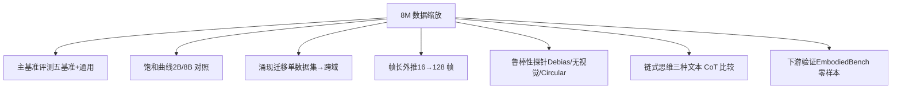

# Scaling Spatial Intelligence with Multimodal Foundation Models

**arXiv**: [2511.13719](https://arxiv.org/abs/2511.13719) · [PDF](https://arxiv.org/pdf/2511.13719)  
**领域**: Multimodal  
**作者**: Cai, Wang, Gu, Pu, Xu, Wang, Yin, Yang 等 29 人  
**综合评分**: 8.91  （novelty: 8.5 · method: 8.5 · evidence: 9.5 · clarity: 8.0）

---

## 摘要

> 本文由商汤科技（SenseTime）研究团队提出，基于其SenseNova系列多模态基础模型（如Qwen3-VL、InternVL3、Bagel），通过构建大规模、系统化的空间智能数据集SenseNova-SI-8M（800万样本），显著提升了多模态基础模型在空间智能方面的能力。该方法在多个空间智能基准测试中取得了领先性能，同时保持了强大的通用多模态理解能力。论文还深入分析了数据缩放效应、涌现的泛化能力、过拟合风险等关键问题，并开源了所有新训练的多模态基础模型。

---

## 详细分析

> **社区热度**: ⭐ 28 (来自 papers.cool)

## 问题定义

论文旨在解决“多模态基础模型在空间智能（Spatial Intelligence, SI）方面显著不足”的核心问题。尽管现有模型在平面视觉-语言任务上表现强劲，它们在三维空间理解、推理与行动（即空间智能）上仍远逊于人类，具体表现为：

- 缺乏对三维几何、尺度、视角变换、遮挡推理等关键空间概念的稳健掌握；
- 训练数据在空间维度上稀缺且高度碎片化，难以支撑系统性的空间能力习得；
- 社区对“如何通过数据扩增有效培养空间智能”缺乏系统研究与可复现基线。

为此，作者提出以**数据为中心**的范式，在不改动模型架构的前提下，通过构建并公开**800万条覆盖五大空间能力的高质量问答对（SenseNova-SI-8M）**，系统探究空间智能的**数据缩放规律**，并验证：

1. 大规模、多样化、任务均衡的空间数据能显著提升多模态模型在VSI-Bench、MMSI、MindCube、ViewSpatial、SITE等空间基准上的性能，达到开源模型新最佳（InternVL3-8B 在 VSI-Bench 达 68.7%，超越 GPT-5 的 55.0%）。
2. 数据扩增不仅带来任务内提升，还出现**跨任务迁移与上下文长度外推**等“早期涌现”迹象。
3. 通过严格反作弊（circular test、去视觉输入等）验证，模型增益并非依赖语言捷径或记忆过拟合。
4. 在无需微调的下游机器人操作任务（EmbodiedBench）中，空间增强版模型直接带来>60%成功率提升，初步展示对具身智能的实用价值。

综上，论文目标可概括为：

> **构建并开源一套可复现的“空间智能数据缩放”基线，系统验证数据而非架构创新是现阶段提升多模态模型空间能力的最有效手段，为未来算法与数据协同研究提供坚实基础。**

## 相关工作

论文在第2节“Related Works”中将与本研究直接相关的文献归为两大主线，并进一步细分。以下按这两条主线梳理关键相关研究，并补充其与本工作的关联点。

---

### 2.1 多模态基础模型（Multimodal Foundational Models）
| 代表模型 / 基准 | 与本工作的关系 |
|---|---|
| **GPT-5** [32] | 作为最强闭源基线，在空间智能基准上被 SenseNova-SI 超越，揭示闭源模型在空间维度仍有显著缺口。 |
| **Gemini-2.5-pro** [38]、**Grok-4** [49]、**Seed-1.6** [37] | 同期闭源多模态大模型，在表1中用作高参考点，验证开源模型通过数据扩增可媲美或超过闭源性能。 |
| **Qwen-VL 系列** [2,3,12,42] | 本工作直接选取 Qwen3-VL-2/8B 作为基底，验证数据缩放策略对“语言→视觉”扩展范式的有效性。 |
| **InternVL 系列** [10,44,60] | 本工作另一基底，原生多模态训练代表；实验表明同一数据策略对“原生多模态”与“语言扩展”两种预训练范式均适用。 |
| **Bagel** [14] | 统一理解与生成的新架构，被选为第三种基底，验证数据驱动空间能力对生成式统一模型同样有效。 |
| **EASI 基准** [6] | 提出空间智能五维能力分类法（MM/SR/PT/MR/CR），为本研究数据构建与实验分析的理论框架。 |

---

### 2.2 面向空间智能的多模态模型（Multimodal Models for Spatial Intelligence）
现有方法可二分为“引入 3D 专家”与“构建空间数据”两条技术路线，本工作属于后者并进一步系统放大。

#### A. 引入 3D 专家（3D-aware Architecture）
| 工作 | 关键思路 | 与本工作对比 |
|---|---|---|
| **Spatial-MLLM** [47] | 输入级引入 VGGT [40] 3D 编码器，增强几何先验。 | 需修改模型结构；本工作零结构改动，仅数据驱动。 |
| **VLM-3R** [15] | 将几何 token 与相机位姿 token 并入股骨头，再做融合。 | 同样依赖额外 3D 模块；本工作证明纯数据即可取得更高指标。 |
| **3DThinker** [9] | 输出级对齐模型隐式 3D 特征与 VGGT 监督。 | 需要输出层蒸馏；本工作避免任何 3D 监督信号，降低实现门槛。 |

#### B. 构建空间数据（Data-centric Spatial Training）
| 工作 | 数据规模 & 覆盖能力 | 与本工作对比 |
|---|---|---|
| **SpatialVLM** [8] | 2B 自动生成两物体空间关系 QA；仅覆盖 SR。 | 数据单一、无视角变换；本工作 8M 覆盖五大能力，PT/MR 大幅扩增。 |
| **MindCube** [57] | 26K 人工标注 + 认知地图，聚焦 MR。 | 数据量小；本工作复用其任务定义但纳入 8M 混合训练，性能提升 106%。 |
| **SpatialLadder** [26] | 26K 样本 + 三阶段渐进训练。 | 数据量与任务范围均受限；本工作单阶段训练即显著超越。 |
| **SpaceR** [33] | 135K RL 微调，针对视频空间推理。 | 强化学习成本高；本工作纯监督缩放，结果全面优于 SpaceR。 |
| **VST** [53] | 4.1M SFT + 135K RL，分阶段训练。 | 数据量相近，但缺少大规模 PT 数据；本工作在 VSI/MMSI 等基准上领先。 |
| **Cambrian-S** [54] | VSI-590K 视频数据 + 四阶段训练。 | 视频帧数多（64/128），本工作 16 帧即可取得更高精度，凸显数据质量与 PT 数据重要性。 |
| **MultiSpa** [50] | 较早提出多帧空间问答，仅有点级对应与相机运动子任务。 | 本工作将其纳入 4M 开源子集，并额外生成 4.5M 以补齐 PT 缺失项（物体/场景级对应、allocentric 变换等）。 |

---

### 小结
- **架构派**通过引入 3D 先验或模块提升空间能力，但需修改模型，迁移成本高。  
- **数据派** prior work 常聚焦单一能力或小规模数据，导致任务覆盖不全、性能饱和。  
- **本工作**在“零架构改动”前提下，首次将空间数据系统扩增至 8M 规模并均衡五大能力，验证**数据缩放是当前提升空间智能最高效、最通用且最易复现的路径**，同时建立新的开源强基线 SenseNova-SI。

## 解决方案

论文采用“**数据为中心、零架构改动**”的策略，通过**系统化构建超大规模、能力均衡的空间问答数据**并执行**多基底模型持续训练**，来解决多模态基础模型空间智能不足的问题。核心流程可归纳为五步：

---

### 1. 能力分解：以 EASI 五维分类法为蓝图  
将“空间智能”拆成**五大可度量能力**，确保数据构建与评估维度一一对应：

- **MM**（Metric Measurement）  
- **SR**（Spatial Relations）  
- **PT**（Perspective-taking）  
- **MR**（Mental Reconstruction）  
- **CR**（Comprehensive Reasoning）

---

### 2. 数据整合：8M 语料“双轮驱动”  
| 阶段 | 来源 | 规模 | 关键操作 |
|---|---|---|---|
| **Reuse** | 公开数据集（VSI-590K、CLEVR、REL3D、MultiSpa、MindCube 等） | 4.0 M | 统一格式、去重、能力标签映射 |
| **Scale** | 3D 场景库（ScanNet、ScanNet++、SUN RGB-D、Matterport3D、Ego-Exo4D、MessyTable、CA-1M） | 4.5 M | 针对 PT/MR 缺口，自动合成大规模 QA： • 点/物/场景级跨视角对应 • 相机运动方向/幅度/旋转角 • 物体中心、假设视角、egocentric→allocentric 变换 • 遮挡推理与物体重建 |

最终得到 **SenseNova-SI-8M**（实际 8.5 M QA），能力分布趋于均衡，PT 与 MR 占比由 <5% 提升至 25%+。

---

### 3. 训练范式：持续预训练 → 零成本下游迁移  
- **基底模型**：Qwen3-VL-2/8B、InternVL3-2/8B、Bagel-7B-MoT（三种不同预训练范式）  
- **训练配置**：1 epoch，2048 batch，128 GPU，AdamW $5\times10^{-6}$，最大 16 帧视频  
- **不引入任何新模块或损失**，保持原始结构与 tokenizer，仅替换数据分布。

---

### 4. 评估体系：五大量化基准 + 防作弊探针  
| 基准 | 考察能力 | 论文结果（InternVL3-8B） |
|---|---|---|
| VSI-Bench | 长时视频空间布局 | **68.7**（+26.2 vs GPT-5） |
| MMSI-Bench | 多图人工难题 | **43.3**（+11.5 最佳开源） |
| MindCube | 遮挡视角心理建模 | **85.6**（+34 vs 原SoTA） |
| ViewSpatial | 多视角定位 | **54.6**（+12 最佳开源） |
| SITE | 抽象空间泛化 | **50.1**（+9 最佳开源） |

同时设计 **VSI-Debiased、Circular-Test、无视觉输入** 三套探针，验证增益并非语言捷径或过拟合。

---

### 5. 下游验证：零微调机器人操控  
将 SenseNova-SI-InternVL3-8B 直接作为视觉-语言-动作（VLA）推理引擎，在 **EmbodiedBench** 空间子集上：

- 官方提示 → 成功率由 10.4% → **16.6%**（+59.6% 相对提升）  
- 空间增强提示 → 20.8% → **33.3%**（+60.0% 相对提升）

证明**纯数据获得的空间能力可无缝迁移至真实机器人任务**，无需额外微调或 RL。

---

### 总结  
论文通过“**能力分解 → 数据扩增 → 持续训练 → 严格评测 → 下游验证**”的闭环，首次系统验证了：

> **在不改变模型结构的前提下，仅通过大规模、多样化、能力均衡的空间问答数据，即可让主流多模态基础模型获得显著、可泛化、可落地的空间智能。**

## 实验验证

论文围绕“数据缩放能否及如何提升空间智能”这一核心问题，共设计了**六大类实验**，覆盖**主基准评测、消融、饱和曲线、涌现现象、鲁棒性探针、链式思维与下游任务验证**。所有实验均基于同一套 8M 数据与同一训练配置，保证结果可比。

---

### 1. 主基准评测（§5.2）
| 实验目的 | 验证 SenseNova-SI 在五大空间基准与通用理解基准上的绝对性能 |
|---|---|
| 对照组 | ① 闭源：GPT-5、Gemini-2.5-pro、Grok-4、Seed-1.6 ② 开源通用：Qwen3-VL、InternVL3、Bagel ③ 开源空间专用：VST、Cambrian-S、SpatialLadder、SpaceR … |
| 关键结果 | InternVL3-8B 变体在 VSI/MMSI/MindCube/ViewSpatial/SITE 全部取得**新最佳开源成绩**，其中 VSI 68.7% 超 GPT-5 55.0%；通用 MMBench-En 仍保持 84.9%，无灾难遗忘。 |

---

### 2. 数据缩放消融与饱和曲线（§5.3）
| 实验目的 | 量化“数据量 → 性能”关系，观察是否出现平台期 |
|---|---|
| 设置 | 从 0.5M → 8.5M 等间隔采样 6 个数据子集，分别训练 InternVL3-2B 与 8B；固定其余超参。 |
| 观测指标 | 五大能力子平均分、单能力子分、±0.5σ 置信带 |
| 结论 | ① 全能力随数据单调上升，PT 增益最大； ② 2B 模型在 PT 上更早饱和，提示**模型容量瓶颈**； ③ 8B 仍未完全饱和，但斜率已明显下降，暗示**仅靠数据难以达到人类水平**。 |

---

### 3. 涌现与迁移实验（§5.4）
#### 3.1 单数据集 → 跨域迁移（Controlled Spill-over）
| 训练集 | Ego-Exo4D 仅“egocentric↔exocentric 视角匹配”任务 |
|---|---|
| 测试集 | MMSI 子任务：Maze Pathfinding、Pos-Cam-Cam |
| 结果 | 在**完全未见的迷宫/朝向问答**上相对提升 +23.8%、+25.6%，表明模型学到**跨视角几何通用技能**。 |

#### 3.2 帧长外推（Extrapolation）
| 设置 | 训练最多 16 帧，推理时 16/32/64/128 帧可变 |
|---|---|
| 结果 | 32 帧达最优 68.7%，64 帧仍持平；对比 Cambrian-S（训练 64/128 帧）在更少帧下取得更高分，说明**内部空间表征已超越训练时序长度**。 |

---

### 4. 鲁棒性 & 捷径分析（§5.5）
| 探针 | 目的 | 主要结果 |
|---|---|---|
| **VSI-Debiased** [4] | 剔除可文本猜答案的样本 | SenseNova-SI 掉分 6.0 ppt，远小于 Cambrian-S 的 7.9 ppt，**更依赖视觉**。 |
| **无视觉输入** | 测语言先验 | 性能由 85.6 → 52.5（掉 33.1），原 SoTA 仅掉 1.0，证明**本模型真正使用视觉**。 |
| **Circular-Test** [6] | 打乱选项顺序 | Soft 掉 1.6 ppt，Hard 掉 10.0 ppt，原 SoTA 掉 28.6 ppt，显示**对文本模式不敏感**。 |

---

### 5. 空间链式思维（CoT）对比（§5.6）
| 变量 | 三种文本 CoT 格式（GPT-5 直接生成、MindCube 粗网格 CogMap、本 elaborated 细坐标 CogMap） |
|---|---|
| 训练量 | 各约 100 k QA |
| 评估任务 | VSI-Bench Object-Relative-Direction（易/中/难三分） |
| 结果 | 最佳 CoT 仅带来 **+3.0 ppt** 绝对提升，且输出 token 增加 60×；**数据缩放带来的+17.7 ppt 增益远高于任何文本 CoT 变体**。作者据此指出：文本链式思维对空间推理非本质，需探索视觉-几何协同的新推理范式。 |

---

### 6. 下游机器人操控零样本验证（§5.7）
| 平台 | EmbodiedBench 空间子集（Franka Panda 仿真，含“左/上/后方/水平”等自然语言指令） |
|---|---|
| 设定 | 无微调，仅 prompt 工程：官方提示 (OP) vs 空间增强提示 (SIP) |
| 指标 | 任务成功率 |
| 结果 | 通用模型 10.4% → SenseNova-SI 16.6%（+59.6%）；SIP 下 20.8% → 33.3%（+60.0%）。**首次证明纯数据增强的空间智能可直接转化为实体任务提升**。 |

---

### 实验全景图

以上六大类实验共同支撑论文结论：**在现有架构下，系统级空间数据扩增是当前提升多模态模型空间智能最有效、最通用、最具落地价值的路径**。

## 未来工作

以下展望均基于论文“数据缩放已带来初步空间智能，但尚未达人类水平且出现饱和迹象”这一核心观察，可归纳为**数据、模型、评测、理论与下游**五大方向的开放问题。

---

### 1. 数据层面
- **几何-语义协同生成**  
  现有 8M 数据仍以“文本模板+3D 场景采样”为主，可探索：
  - 扩散/NeRF- conditioned GPT 进行**几何一致的多轮对话式生成**，提升问答多样性与几何精度。
  - 引入**程序生成管线**（ProcSG、BlenderProc）按需合成**极端遮挡、非朗曲、动态物理**场景，测试模型对“分布外几何”的稳健性。

- **跨模态对齐粒度细化**  
  将点云、网格、深度、光流、表面法向量等**显式几何信号**作为并行输入分支，构建“像素-体素-语言”三模态对齐数据，考察更细粒度空间度量（毫米级误差、曲率估计等）。

- **长时序-大空间数据**  
  目前视频最长 16 帧≈8 s，可构建**百帧级室内/室外连续扫描**（+GPS/IMU）问答对，检验模型对**大尺度拓扑与 metric-consistent SLAM** 的理解。

---

### 2. 模型层面
- **视觉-几何协同推理架构**  
  文本 CoT 增益有限提示需**几何原生推理**：
  - 在 LLM 中引入**pluggable 几何缓存**（persistent 3D transformer memory），显式维护世界坐标系下的点-物-面表征。
  - 探索**Diffusion-for-Geometry** 解码器，让模型在回答前先生成深度/占用图，再据此产生文本，实现“先重建后推理”。

- **多视角-多模态统一预训练目标**  
  借鉴对比学习与 masked 3D modeling，设计**跨视角-跨模态联合掩码恢复任务**（image+depth+text 同时随机掩码），鼓励模型自学视角一致性。

- **参数高效继续学习**  
  饱和曲线显示 2B 模型容量瓶颈，可尝试：
  - LoRA/MoE 插件仅更新<10% 参数，专责空间推理，减缓遗忘。
  - **动态数据课程**——由易到难逐步增加 PT/MR 样本比例，观察能否突破平台期。

---

### 3. 评测与理论
- **人类对齐的“空间智商”量表**  
  现有基准为离散准确率，可设计**连续度量**（角度误差 cm 级距离、人类响应时间匹配）并收集**千人级人类对照组**，建立类似“视觉空间 IQ”标准化分数，便于跨模型-跨人类比较。

- **可解释空间注意力探针**  
  利用 3D 重建网络（VGGT、RoSS3D）生成伪真值深度，检验模型 cross-attention 是否**聚焦几何一致区域**；开发“注意力-深度一致性得分”作为空间可解释性指标。

- **能力-数据 scaling law 形式化**  
  借鉴 $L(N,D)$ 语言 scaling law，拟合**空间误差 ε 与数据量 D、模型参数量 N、能力维度 C** 的联合函数，预测达到人类水平所需算力与数据量级。

---

### 4. 链式推理新范式
- **视觉-动作链式推理（V-CoT）**  
  不再用文字，而是让模型输出**一系列 3D 姿态或相机轨迹**作为“中间思考”，再用轨迹-conditioned 文本解码器生成最终答案；评测是否比纯文本 CoT 更可靠。

- **自洽几何验证（Self-Consistent Geometry）**  
  对同一问题采样多条 3D 轨迹，检查其**几何一致性**（轨迹交集误差、重投影误差），采用“几何投票”决定最终答案，降低幻觉。

---

### 5. 下游与具身智能
- **实时闭环 VLA 部署**  
  将 SenseNova-SI 作为视觉-语言-动作策略的**高速推理核心**（<50 ms），在真实机械臂上运行，考察**动态遮挡、主动感知**场景下的成功率与故障模式。

- **跨机器人迁移**  
  在仿真中训练，在**不同形态**（四足、无人机、移动操作臂）上零样本测试，验证空间理解是否**与 embodiment 无关**。

- **人机协作空间对话**  
  引入**人类手势+语音指代表达**（“把这个放到那边靠近窗户的架子上”），评测模型对**多模态指代、模糊度量、安全约束**的综合推理能力。

---

### 6. 风险与伦理
- **空间幻觉与安全隐患**  
  建立“**空间对抗问答**”基准：输入含故意尺度-视角陷阱的图像，测量模型是否输出**危险或物理不可能**的动作；开发校准方法降低高风险场景幻觉率。

- **数据授权与隐私**  
  大规模室内扫描涉及家具布局、人脸等敏感信息，需研究**自动匿名化+合成替换**流程，并发布隐私影响评估报告。

---

### 总结
> 数据缩放已打开“空间智能”大门，但**几何原生架构、细粒度评测、人类对齐理论、实体落地与安全伦理**仍是空白。上述方向既包含可即刻开展的实证课题，也涉及对空间推理本质的基础研究，可供社区在未来 3–5 年持续深耕。

## 总结

**SenseNova-SI：用 800 万空间问答对把多模态基础模型“升级”为空间智能强基线**

---

### 1. 问题
- 现有 VLM 在 3D 空间理解、视角推理、度量估计等任务上仍远逊于人类。
- 空间数据稀缺且碎片化，缺乏系统化的“数据缩放”研究。

---

### 2. 方案
**数据为中心、零架构改动**  
① 按 EASI 五维能力（MM/SR/PT/MR/CR）重组并扩增数据  
   - 复用 4M 开源问答 + 自产 4.5M 新问答 → **SenseNova-SI-8M**  
   - 重点补齐“视角变换 PT”与“心理重建 MR”缺口  
② 持续训练三种基底（Qwen3-VL、InternVL3、Bagel），1 epoch，无新增模块

---

### 3. 结果
| 基准 | 指标 | 最佳开源成绩（InternVL3-8B） | 相对提升 |
|---|---|---|---|
| VSI-Bench | 68.7% | **+26.2 ppt 超 GPT-5** |
| MMSI-Bench | 43.3% | **+11.5 ppt 最佳开源** |
| MindCube | 85.6% | **+34.0 ppt 原 SoTA** |
| ViewSpatial | 54.6% | **+12 ppt 最佳开源** |
| SITE | 50.1% | **+9 ppt 最佳开源** |
| MMBench-En | 84.9% | 无灾难遗忘 |

---

### 4. 发现
- **数据缩放律**：性能随数据单调升，PT 增益最大；2B 模型更早饱和。
- **早期涌现**：单任务训练即可跨域迁移（egocentric→迷宫路径）；16 帧训练可外推至 64 帧。
- **非捷径**：VSI-Debiased、无视觉、Circular-Test 三重探针显示模型**真用视觉而非语言先验**。
- **文本 CoT 边际**：三种链式思维仅 +3 ppt，远低于数据缩放带来的 +17 ppt，提示需几何原生推理。
- **零样本落地**：直接驱动 Franka 机器人，空间任务成功率 **+60%**，无需微调。

---

### 5. 贡献
- 开源**800 万空间问答对**与系列权重，供社区跳过昂贵数据阶段。
- 首次系统验证“**纯数据驱动即可让主流 VLM 获得 SOTA 空间智能**”，为后续算法-数据协同研究奠定强基线。

Q7: 想要进一步了解论文

以上只是了解一篇论文的几个基本FAQ。如果你还想与Kimi进一步讨论该论文，请点击 这里  为你跳转Kimi AI网页版，并启动一个与该论文相关的新会话。
