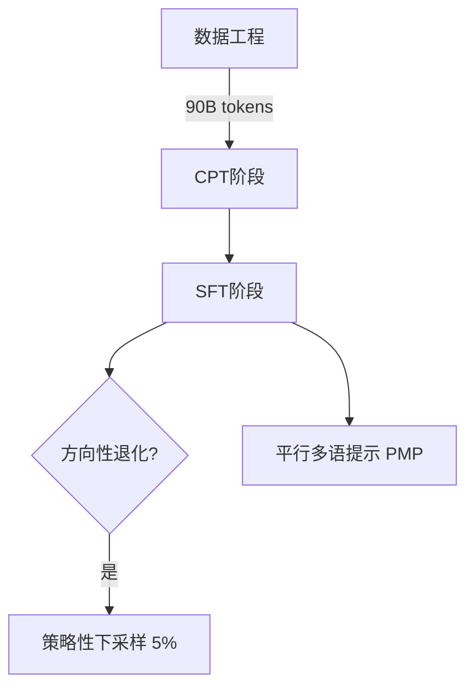

# NiuTrans.LMT: Toward Inclusive and Scalable Multilingual Machine Translation with LLMs

**arXiv**: [2511.07003](https://arxiv.org/abs/2511.07003) · [PDF](https://arxiv.org/pdf/2511.07003)  
**领域**: SFT  
**作者**: Luo, Xu, Ouyang, Yang, Lin, Chang, Zheng, Li 等 12 人  
**综合评分**: 8.21  （novelty: 8.5 · method: 8.5 · evidence: 9.5 · clarity: 8.0）

---

## 摘要

> 本文由NiuTrans团队（小牛翻译，专注于机器翻译技术的知名研究机构）提出了一种针对大语言模型多语言机器翻译（MMT）的改进方案。论文首先识别了多语言监督微调（SFT）中存在的“方向性退化”问题，并提出了两种创新方法（战略下采样SD和并行多语言提示PMP）来缓解此问题。基于此，团队构建并开源了覆盖60种语言、包含4个不同参数规模（0.6B-8B）的NiuTrans.LMT模型套件。实验表明，其4B模型性能可与规模更大的基线模型相媲美。论文问题定位准确，解决方案有效且具备工程实践价值，实验验证充分，并开源了模型资源，对推动包容性和可扩展的多语言翻译研究有积极贡献。

---

## 详细分析

> **社区热度**: ⭐ 3 (来自 papers.cool)

## 问题定义

论文旨在突破当前大模型多语机器翻译（MMT）中“英语中心”与“质量随语言覆盖度下降”的双重瓶颈，具体聚焦以下核心问题：

1. 语言覆盖不足  
   现有 LLM-based MMT 工作大多以英语为唯一枢纽，对中文及其他高需求语言支持有限，导致真实场景中的翻译需求得不到满足。

2. 翻译质量不一致  
   随着语言数量增加，低资源语言性能急剧衰减；同时，对称多向微调数据在反向方向（X→En/Zh）引发“方向性退化”，即模型学会把多种源语映射到高频英/中模板，出现幻觉与忠实度下降。

3. 数据稀缺与失衡  
   非英-语向的平行语料极度稀缺，中文中心方向尤甚，使得监督信号不足，制约了监督微调阶段的效果。

4. 扩展性与实用性  
   已有系统要么参数规模过大（数十亿甚至百亿），要么语言覆盖窄，难以在“高覆盖-高质量-可扩展”三者间取得平衡。

为此，作者提出 LMT 系列模型，通过“中文-英语双枢纽”设计覆盖 60 种语言、234 个翻译方向，并配套：

- 策略性下采样（Strategic Downsampling）缓解方向性退化；  
- 平行多语提示（Parallel Multilingual Prompting）利用高资源辅助语提升低资源方向；  
- 大规模持续预训练+高质量微调数据管道，实现参数高效、质量稳定的多语翻译。

## 相关工作

论文将相关研究划分为两大主线，并指出各自遗留的空缺，据此定位自身贡献。按时间顺序与关联度归纳如下：

---

### 1. 神经机器翻译（NMT）时代的大规模多语系统  
| 代表工作 | 关键特征 | 与本文关系 |
|---|---|---|
| **Johnson et al. 2017** Google Multilingual NMT | 首次验证“一个模型译所有语言”的可行性，引入共享编码器-解码器与人工语言标签。 | 奠定了“多向统一模型”思想，但未解决低资源方向质量骤降问题。 |
| **Arivazhagan et al. 2019** Massively Multilingual NMT | 在 103 种语言上实验，观察到 En→X 与 X→En 不对称 BLEU 差距。 | 首次量化“方向不对称”现象，但未归因于数据映射结构。 |
| **Fan et al. 2021** M2M-100 | 100×100 方向，依赖反向翻译+大规模采样；仍英中心。 | 语言覆盖广，但中文枢纽缺位，且未讨论“方向性退化”。 |
| **Costa-jussà et al. 2022** NLLB-54B | 200 种语言，Sparsely Gated Expert + 质量估计过滤；提供 FLORES-200 基准。 | 质量与覆盖标杆；LMT 在 60 种语言上 COMET 超越其 13× 参数规模。 |

---

### 2. 大语言模型（LLM）时代的翻译适配  
| 代表工作 | 关键特征 | 与本文关系 |
|---|---|---|
| **Brown et al. 2020** GPT-3 | 首次展示 175B 模型在 0-shot 翻译上的潜力，但英中心且质量波动大。 | 启发“不做专门 NMT，直接适配 LLM”的新范式。 |
| **Yang et al. 2023** BigTranslate | 继续预训练 102 种语言 90B tokens，仍英中心，无中文枢纽。 | 数据规模可比，但语言配置与双枢纽设计不同。 |
| **Xu et al. 2024** ALMA | 仅 6 种语言，聚焦“单语+双语 CPT → 指令微调”小尺度策略。 | 验证了 CPT+SFT 流程，但覆盖窄，未触及方向性退化。 |
| **Alves et al. 2024** TowerInstruct-13B | 10 种高资源语言，双语 CPT+指令微调，提出“翻译任务指令模板”。 | 模板设计被 LMT 继承并扩展为 PMP；语言数少，无中文中心。 |
| **Cui et al. 2025** GemmaX2-28-9B | 28 种语言，首次明确“中文中心”口号，使用 Gemma-2 骨干。 | 与 LMT 目标最接近，但语言数与低资源性能均低于 LMT-60-4B。 |
| **Zheng et al. 2025a** Hunyuan-MT-7B | 33 种语言，中文中心，引入“质量估计+拒绝采样”策略。 | 同期工作，参数少、方向少；LMT 在相同语言子集上 COMET 平均+1.3。 |
| **Cheng et al. 2025** Seed-X-PPO-7B | 27 种语言，200B tokens，使用 PPO 强化学习提升低资源方向。 | 当前最强小模型标杆；LMT-60-8B 在 27 语交集上仅落后 0.3 COMET，但语言覆盖翻倍。 |

---

### 3. 同期/后续触及“方向不对称”或“数据映射陷阱”的研究  
| 工作 | 观察与对策 | 与本文差异 |
|---|---|---|
| **Zheng et al. 2025b** Asymmetric Conflict | 同样报告 X→En/Zh 退化，采用“方向感知训练+分组模型融合”模型级修复。 | 未揭示“多向数据 many-to-one 映射”根源，且需额外参数与融合步骤；LMT 仅用数据级下采样即可恢复。 |

---

### 小结  
- **NLLB、M2M-100** 提供了“广覆盖”标杆，但英中心且参数巨大。  
- **GemmaX2、Hunyuan-MT、Seed-X** 开始转向“中文中心”， yet 语言数或低资源性能仍受限。  
- **TowerInstruct、ALMA** 验证了 CPT+SFT 流程，但未触及方向性退化与跨语迁移增强。  
- **本文首次**系统论证“方向性退化”源于对称多向数据的 many-to-one 映射陷阱，并用极简“策略性下采样”解决；同时提出“平行多语提示”显式激活跨语迁移，实现 60 语言、234 方向、4B 参数即超 13B/54B 模型的 SOTA 性能。

## 解决方案

论文将“广覆盖、高质量、非英中心”的多语机器翻译拆解为**数据-训练-推理**三阶段瓶颈，并给出对应解法，形成一条可复现的完整技术路线：

---

### 1. 数据阶段：构建“中英双枢纽”高质量语料

| 关键障碍 | 具体做法 | 输出规模 |
|---|---|---|
| 非英-语向稀缺，中文中心尤甚 | • 以 OPUS 2.0 为种子，用**开源模型**做伪平行合成： ① 直接合成 En/Zh→X； ② 以英为枢轴 Zh↔En↔X，得到 Zh↔X。 | 英-centric 21 亿句对 中-centric 29 亿句对 |
| 低资源语言噪声大 | • **OpusFilter** 启发式清洗 → **CometKiwi** 质量打分 → 阈值过滤。 | 117 个方向单方向≥1 千万高质量句对 |
| 微调需要小而精的指令数据 | • 合并 Flores-200、NTREX、SMol、WMT14-23、IWSLT17-24 人工译文，按方向分层采样。 | 596 k 句对，每方向 3 k–20 k |

---

### 2. 训练阶段：两阶段适配 + 两大原创策略

#### 2.1 Continued Pre-training（CPT）
- **目标**：把翻译知识“预装”进骨干 LLM，缓解低资源欠拟合。  
- **配方**：90 B token，按 1:1:1 均衡采样  
  – 单语 60 种语言  
  – 英-centric 双语  
  – 中-centric 双语  
- **技巧**：Informative Formatting，显式方向标签 `` + 目标语言分隔符，优于朴素“src\n tgt”拼接。

#### 2.2 Supervised Fine-tuning（SFT）
| 新发现 | 根因 | 解法 | 效果 |
|---|---|---|---|
| **方向性退化** X→En/Zh COMET 暴跌 | 对称多向数据造成**many-to-one 映射陷阱**：同一条英/中句子被 59 种源语重复当作目标，模型学会“捷径”生成高频模板，牺牲忠实度。 | **策略性下采样** En/Zh→X 保留 100 % X→En/Zh 仅随机保留 5 % | 4 B 模型 X→Zh +11.45 COMET，X→En +5.83，回到无退化水平。 |

#### 2.3 Parallel Multilingual Prompting（PMP）
| 目标 | 做法 | 公式化 |
|---|---|---|
| 显式激活跨语迁移，提升低资源方向 | 在指令中追加一条**语义等价的高资源辅助句**（英或同语族语言），让模型“看见”翻译样本。 | $ $  \max_\theta \log P_\theta\bigl(T \mid S,\underbrace{A}_{\text{aux}};\tau_{L_S\to L_A\to L_T}\bigr) |

- **训练时**：STP 与 PMP 各 50 % 混合，避免过度依赖辅助。  
- **推理时**：可零成本切换 ① 标准提示（STP） ② 自生成辅助句（PMP-S） ③ 外部高质量辅助句（PMP-O）

---

### 3. 推理与评估：零资源也能用

- **零样本迁移**：PMP 在“未直接训练”的语向上仍带来 +0.7 COMET 平均增益，证明跨语对齐泛化。  
- **参数效率**：4 B 参数即超过 13× 大的 Aya-101-13B 与 54 B 的 NLLB-54B；8 B 版本逼近专用 200 B tokens 的 Seed-X-PPO-7B，但语言覆盖翻倍。

---

### 4. 结果一览（FLORES-200 devtest, COMET-22）

| 模型 | 参数量 | 语言数 | 高资源 | 中资源 | 低资源 |
|---|---|---|---|---|---|
| NLLB-54B | 54 B | 59 | 87.95 | 88.95 | 85.12 |
| Aya-101-13B | 13 B | 55 | 87.00 | 87.54 | 81.68 |
| **LMT-60-4B** | **4 B** | **60** | **89.10** | **89.86** | **86.92** |

---

### 5. 可复现性与开源

- 四个尺寸 0.6 B / 1.7 B / 4 B / 8 B 全部开源（ms-swift 训练脚本 + 模型权重）。  
- 训练、过滤、评估脚本与辅助语言映射表一并发布，供社区继续扩展至三枢纽或更多低资源语言。

---

### 一句话总结  
论文用“**数据工程 + 方向性下采样 + 平行多语提示**”三板斧，首次在 4 B 规模上同时实现**60 语言、234 方向、中英双枢纽、SOTA 质量**，并揭示了对称多向微调隐藏的 many-to-one 陷阱，为后续大模型多语翻译提供了可复用的基准方案。

## 实验验证

论文围绕“方向性退化”假设与整体系统性能，共设计 5 组核心实验，外加 2 项补充分析，覆盖现象验证、消融、推理策略、零样本迁移与规模扩展性。

---

### 1. 方向性退化现象验证实验
**目的**：证明“对称多向 SFT 导致 X→En/Zh 质量暴跌”具有普适性。  
**设置**：固定 SFT 数据与超参，仅更换基础模型（Qwen3-4B/8B、Llama-3.1-8B、Gemma2-9B）。  
**观测指标**：COMET-22 在 100 % 反向采样比例下的降幅。  
**结论**：4 个骨干模型均出现一致退化，验证为**系统性陷阱**而非单个模型缺陷。

---

### 2. 策略性下采样（SD）敏感性实验
**目的**：找出最小保留比例 p 即可抑制退化。  
**变量**：p ∈ {0, 0.5 %, 1 %, 5 %, 10 %, 20 %, 50 %, 100 %}  
**结果**：
- p ≥ 0.5 % 时 X→En/Zh COMET 迅速回升；
- 最佳拐点 p ≈ 5 %，继续增大无显著增益并略有下降（目标端重复噪声增多）。  
**后续所有 LMT 模型统一采用 p = 5 %**。

---

### 3. 整体性能对比实验
**基准**：FLORES-200 devtest + 自采中文-蒙古语人工测试集  
**对照组**：
- 通用多语 LLM：Aya-Expanse-8B、Aya-101-13B、LLaMAX3-Alpaca-8B  
- 专用 MMT 系统：TowerInstruct-13B、GemmaX2-28-9B、X-ALMA-13B、Hunyuan-MT-7B、Seed-X-PPO-7B、NLLB-54B  

**指标**：COMET-22（主）、SacreBLEU（附录）、WMT24++ 文档级（附录）  
**结果**（节选）：
| 模型 | #lang | 高资源 | 中资源 | 低资源 |
|---|---|---|---|---|
| NLLB-54B | 59 | 87.95 | 88.95 | 85.12 |
| Aya-101-13B | 55 | 87.00 | 87.54 | 81.68 |
| **LMT-60-4B** | **60** | **89.10** | **89.86** | **86.92** |
| Seed-X-PPO-7B | 27 | 89.91 | 91.58 | 91.27 |
| **LMT-60-8B** | **60** | **89.41** | **91.03** | **90.81** |

在相同 27 语言子集上，LMT-60-8B 与 Seed-X 差距 < 0.3 COMET，但语言覆盖翻倍、训练数据总量仅一半。

---

### 4. 消融实验（Ablation）
**基线**：Base + 常规对称 SFT  
**逐组件叠加**：
1. +SD（5 %）
2. +CPT（90 B）
3. +PMP（50 % 混合）

**度量**：60 语言平均 COMET  
**增益**：
- SD：X→Zh +11.45，X→En +5.83
- CPT：全方向 +3.8 ~ +8.23
- PMP：额外 +0.1 ~ +0.25，稳定提升

---

### 5. Parallel Multilingual Prompting 深度分析
#### 5.1 推理策略对比
**条件**：仅对训练时见过 PMP 的语言  
**策略**：
- PT：传统两阶段枢轴
- DT：直接翻译（标准提示）
- PMP-O：使用金标辅助句
- PMP-S：模型自生成辅助句

**结果**：
- PMP-O / PMP-S 均优于 PT/DT；
- **X→En/Zh 方向 PMP-S 反而最佳**，说明自生成辅助与模型内部分布更一致（归因于 SD 造成 PMP 训练稀疏）。

#### 5.2 零样本迁移评估
**分组**：
- In-Group：辅助语恰好是 PMP 训练用的 HRL
- Out-of-Group：辅助语为其他 HRL
- Baseline Group：HRL↔HRL 未用 PMP

**发现**：
- HRL→LRL 提升最大，In-Group +1.8 COMET，Out-of-Group +0.7；
- Baseline Group 亦有 +0.3，表明 PMP 带来**全局跨语对齐增强**。

---

### 6. 多语言规模影响实验（附录）
**设置**：固定 Qwen3-4B，随机抽取 10/20/30/40/50/60 语言做 SFT，观察 100 % 反向采样时的退化程度。  
**结论**：语言数 ≤10 时退化轻微；≥30 时显著；=60 时几乎崩溃，**验证 many-to-one 陷阱随语言规模放大**。

---

### 7. 质量分布与语言级增益分析（附录）
- COMETKiwi 分数直方图：低资源 Zh-X 明显左偏，揭示数据稀缺 + QE 模型英中心偏差。  
- CPT 单语言消融：低资源语言平均 +6 ~ +10 COMET，高资源亦有 +2 ~ +3，证明 CPT 是“普惠型”基础步骤。

---

### 实验总览表

| 实验 | 主要变量 | 关键结论 |
|---|---|---|
| 方向性退化复现 | 基础模型 | 退化普遍存在于现代 LLM |
| SD 比例扫描 | p ∈ [0,100 %] | 5 % 为最优，极小信号即可对齐 |
| 系统对比 | 13 个强基准 | 4 B 超 13×/54× 更大模型，8 B 逼近专用 200 B 系统 |
| 消融 | +SD +CPT +PMP | 三组件互补，缺一则显著落后 |
| PMP 推理/零样本 | 策略/分组 | 自生成辅助最稳健，跨语迁移超出直接监督范围 |
| 规模敏感性 | 语言数 10→60 | 退化强度随语言规模线性加剧 |

以上实验共同支撑了论文提出的“方向性退化”假设与 LMT 整套技术路线的有效性与可扩展性。

## 未来工作

以下展望按“数据-模型-评估-生态”四个维度整理，均直接对应论文已暴露的局限或尚未触及的边界，可作为后续工作切入点。

---

### 1. 数据与语言覆盖
- **三枢纽/多枢纽扩展**  
  当前仅中英双枢纽，可引入西班牙语、阿拉伯语、法语等区域顶层语言，构建“多中心”并行语料，进一步稀释英语边际效应。

- **超低资源与无文字语言**  
  60 种语言仍 < 全球 1 %。可结合圣经-民间语料、语音转写、图像 OCR（如街景招牌）合成伪平行数据，探索“无书面语料”翻译。

- **文化适宜性对齐**  
  现有质量过滤以 COMETKiwi 为主，偏向字面忠实。可引入“文化敏感度”奖励模型，对宗教、习俗、性别等高风险片段进行去偏或本土化改写。

---

### 2. 模型与训练策略
- **方向性退化的理论下界**  
  论文实证给出 5 % 下采样足够，但未从信息论或梯度冲突角度给出最小比例公式。可建立“目标端重复度 ↔ 退化强度”量化模型，指导任意语言规模的采样率。

- **动态下采样 + 课程学习**  
  当前比例固定。可在训练过程中按验证集 COMET 自适应调整 p，或先高后低课程式，减少过早欠拟合风险。

- **PMP 的辅助语言选择自动化**  
  现用人工规则（同语族/英枢轴）。可训练“辅助语言选择器”以强化学习方式最大化低资源方向 BLEU，实现语言组合自动搜索。

- **多模态 PMP**  
  将辅助句换成图像、视频帧或语音，验证“跨模态语义锚点”能否进一步提升极低资源翻译，例如非洲手语 ↔ 文本。

---

### 3. 评估与鲁棒性
- **真实场景压力测试**  
  论文主要用 FLORES-200 与 WMT24++。可扩展至：  
  - 用户生成内容（UGC）（拼写错误、俚语、emoji）  
  - 长篇零指代、跨段落一致性  
  - 口语同声传译延迟-质量权衡

- **文化适宜度与安全性基准**  
  构建包含宗教禁忌、种族贬称、政治敏感句对的多语测试集，衡量模型在“忠实”与“安全”冲突时的取舍。

- **QE 模型去英中心化**  
  COMETKiwi 对非英方向评分偏低。可收集人工质量标签，重新训练“多中心 QE”模型，减少循环依赖。

---

### 4. 系统与生态
- **边缘部署量化**  
  4 B 模型在 16×H200 上训练，推理仍需 24 GB 级显存。可探索 4-bit / 8-bit 量化、MoE 蒸馏至 1 B 以内，服务手机离线翻译。

- **交互式纠错协议**  
  结合人类-模型协作：用户实时后编辑 → 模型增量学习，形成“数据飞轮”，持续增强低资源方向。

- **开源数据管道模块化**  
  把伪平行合成、质量过滤、PMP 样本生成封装为可插拔组件，支持社区一键添加新语言，实现“滚动式”多语生态。

---

### 5. 前沿交叉方向
- **大模型多语翻译 ↔ 机器写作**  
  利用生成侧能力，在翻译同时自动产出“地域化营销文案”或“儿童文学简化版”，实现“翻译+改写”一体化。

- **与代码切换共存**  
  社交媒体常见中英混写。探索“语内代码切换”翻译，如 Hinglish → 纯 Hindi 或标准英语。

- **联邦多语训练**  
  数据分散在不同国家，隐私不可出境。采用联邦学习+差分隐私，协同训练全球模型而无需原始数据出境。

---

### 可立即动手的小课题示例
1. 在 60 语言基础上再增加 30 种印度/非洲语言，验证“5 % 下采样”经验法则是否仍成立。  
2. 将 PMP 辅助句换成 LLM 自己生成的“同义复述句”，测试是否比跨语辅助更有效。  
3. 用注意力可视化工具检查 many-to-one 陷阱：当 p=100 % 时，解码器是否对源语关注显著下降。  
4. 构建中文-维吾尔语-阿拉伯语三向测试集，评估三枢纽相比双枢纽的增益边际。

以上任意一条均可作为硕士/博士阶段可落地的后续研究，且与本文开源代码与数据直接衔接。

## 总结

**论文核心内容一览**

---

### 1. 研究动机
- **英语中心**：现有 LLM 多语翻译以英语为唯一枢纽，中文等高频需求语言覆盖不足。  
- **质量失衡**：语言数增加后，低资源方向性能骤降；对称多向微调导致反向（X→En/Zh）出现“方向性退化”——幻觉、忠实度下降。  
- **参数效率**：大模型（13B–54B）虽强，但语言覆盖与性价比仍不理想。

---

### 2. 贡献总览
| 贡献 | 一句话总结 |
|---|---|
| **LMT 模型族** | 中英双枢纽，60 语言、234 方向，4 个规模（0.6B–8B）全部开源。 |
| **方向性退化发现** | 首次揭示对称多向数据造成 many-to-one 映射陷阱，提出极简“策略性下采样”(5 %) 即可恢复。 |
| **平行多语提示(PMP)** | 在指令中追加一条高资源辅助句，显式激活跨语迁移，训练/推理零成本切换。 |
| **SOTA 性能** | 4B 参数超 13× 更大的 Aya-101-13B 与 NLLB-54B；8B 逼近 200 B tokens 的 Seed-X-PPO-7B，语言覆盖翻倍。 |

---

### 3. 技术路线（两阶段三把斧）

1. **数据工程**  
   - 伪平行合成 + CometKiwi 质量过滤 → 英-centric 21 亿句对、中-centric 29 亿句对。  
   - 微调集 596 k 人工译文，覆盖 117 方向。

2. **CPT**  
   - 单语∶英双∶中双 = 1∶1∶1，Informative Formatting 带方向标签。

3. **SFT**  
   - **SD**：En/Zh→X 全量，X→En/Zh 仅 5 %。  
   - **PMP**：中低资源方向 50 % 训练样本附加高资源辅助句；推理可自生成辅助，无需外部模型。

---

### 4. 主要实验结果
| 模型 | 参数量 | 语言 | 高资源 | 中资源 | 低资源 |
|---|---|---|---|---|---|
| NLLB-54B | 54 B | 59 | 87.95 | 88.95 | 85.12 |
| Aya-101-13B | 13 B | 55 | 87.00 | 87.54 | 81.68 |
| **LMT-60-4B** | **4 B** | **60** | **89.10** | **89.86** | **86.92** |

- 消融：SD 单方向最高 +11.45 COMET；CPT +3.8~+8.23；PMP 再 +0.1~+0.25。  
- 零样本：PMP 对未直接训练的方向仍 +0.7 平均增益。  
- 规模测试：语言数 ≥30 时退化显著，≥60 时几乎崩溃，验证 many-to-one 陷阱随规模放大。

---

### 5. 局限与展望
- 仅中英双枢纽；文化适宜性、口语、长篇一致性待扩展。  
- 60 语言仍远少于全球 7000+；需引入无文字语料、联邦学习等。  
- QE 模型与质量过滤仍英中心，需多中心质量评估。

---

### 一句话总结  
LMT 用“中英双枢纽数据 + 5 % 策略性下采样 + 平行多语提示”三把斧，在 4 B 参数上实现 60 语言 234 方向 SOTA，首次破解对称多向微调的方向性退化陷阱，为高性价比、广覆盖、非英中心的多语翻译提供可直接复用的开源基线。

Q7: 想要进一步了解论文

以上只是了解一篇论文的几个基本FAQ。如果你还想与Kimi进一步讨论该论文，请点击 这里  为你跳转Kimi AI网页版，并启动一个与该论文相关的新会话。
